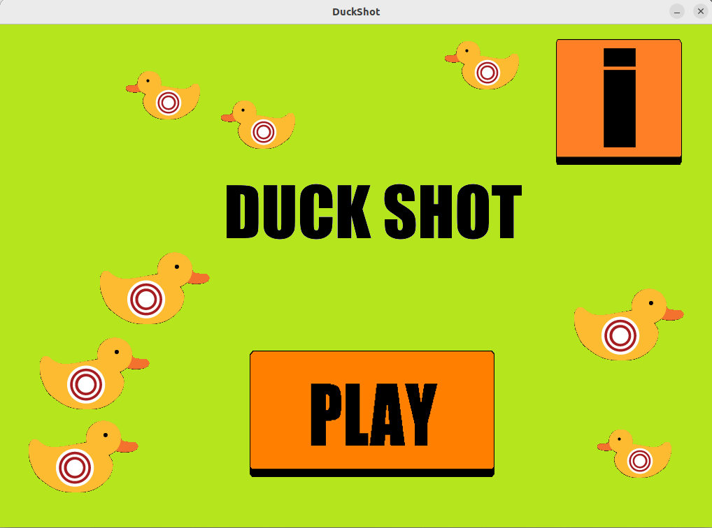
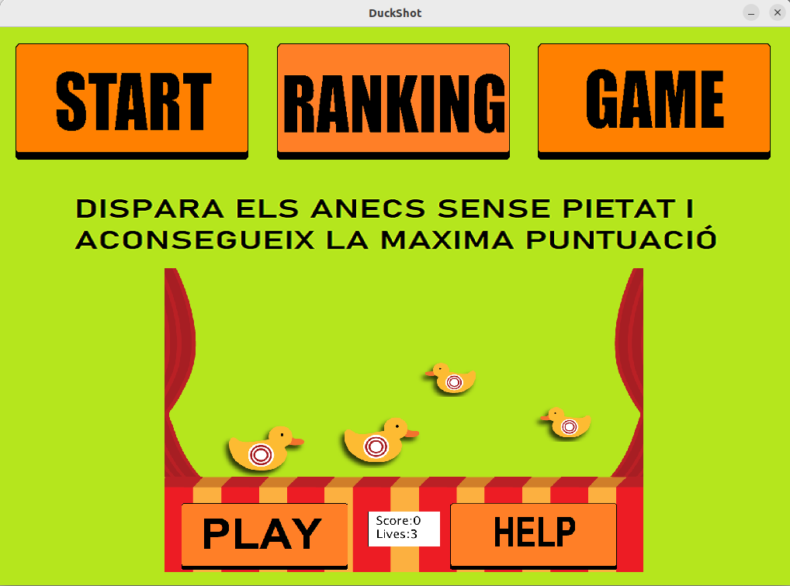
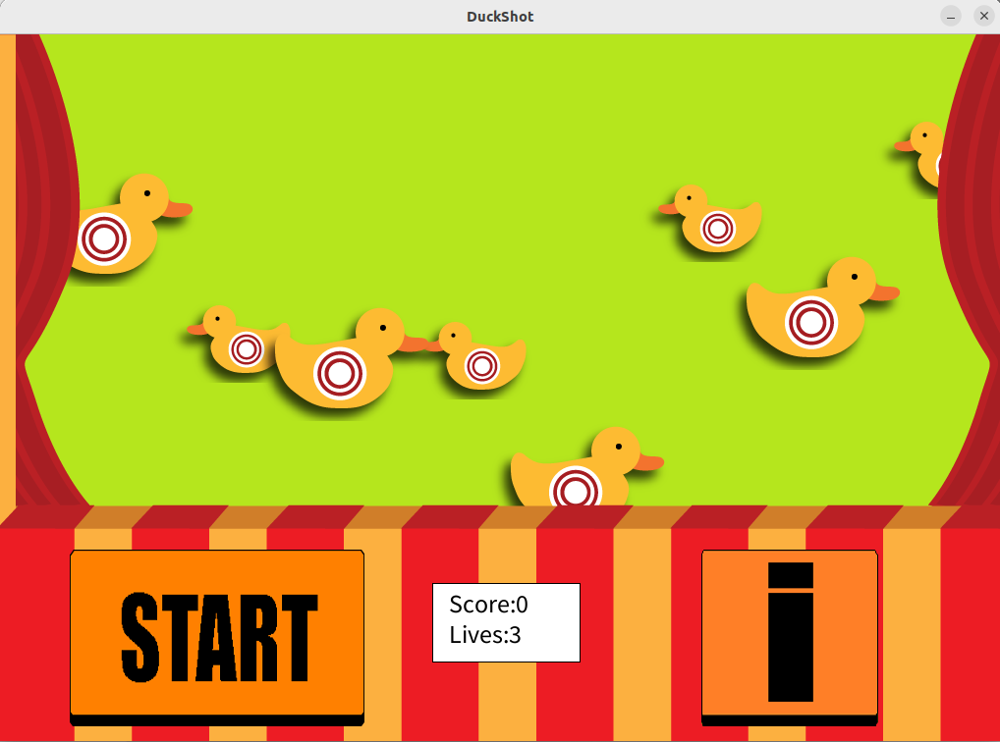
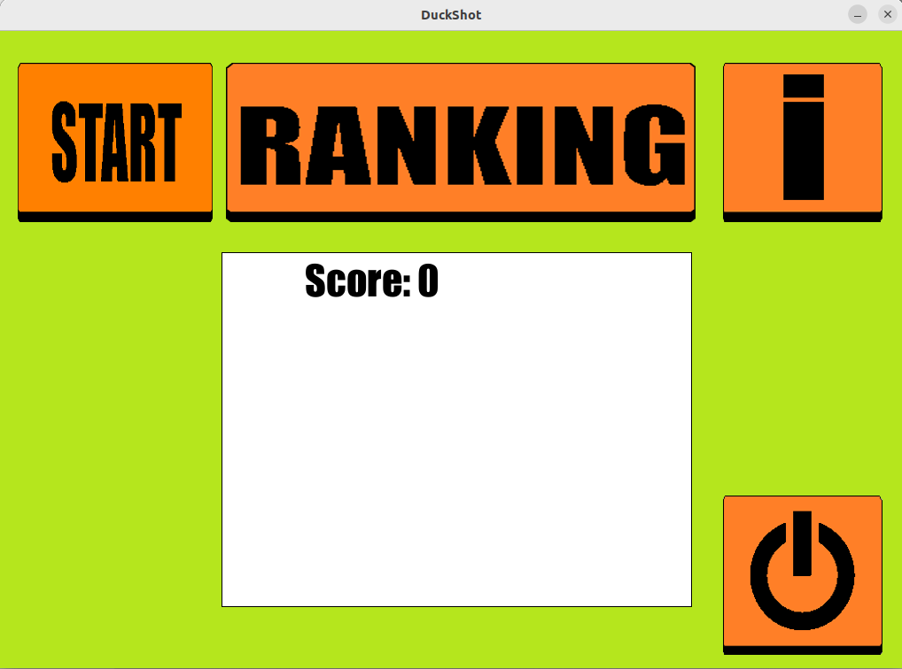

# duck shot

Welcome to duck shot Game! This is a simple and fun game where players kill as many ducks they can!. The game is built using [Processing](https://processing.org/) and is a great example of a casual game for computer.

## Table of Contents

- [Features](#features)
- [Getting Started](#getting-started)
- [Gameplay](#gameplay)
- [Contributing](#contributing)
- [License](#license)

## Features

- Kill ducks and earn points.
- Simple and intuitive controls.
- Beautiful and engaging visuals.

## Getting Started

To play Duck shot on your local machine, follow these steps:

1. Clone this repository: `git clone https://github.com/enriqueseor/duck-shot.git`
2. You must have to install processing 4.
3. Open any .pde file you find inside the project folder.
4. Press the Run top-right button.

## Gameplay

- Click on the duck to kill them.
- Collect as many ducks as you can to earn points.
- Avoid to not collecting them, as they will reduce your health.
- The game ends when your health reaches zero.

## Contributing

Contributions are welcome! If you'd like to contribute to Duck shot, please follow these steps:

1. Fork this repository.
2. Create a new branch: `git checkout -b feature/your-feature-name`.
3. Make your changes and commit them: `git commit -am 'Add new feature'`.
4. Push to the branch: `git push origin feature/your-feature-name`.
5. Create a pull request.

## License

This project is licensed under the [MIT License](LICENSE).
